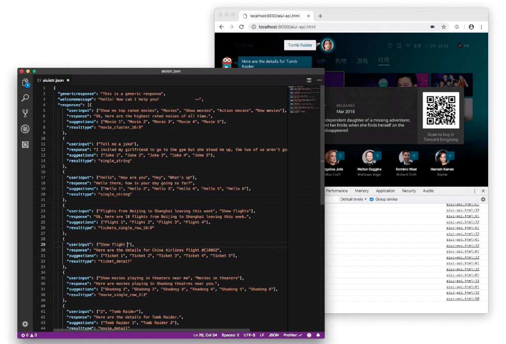

# Voice Synthesis & Speech Recognition Prototype

This is a sample of a prototype created to simulate voice interactions in a display interface.

The prototype combined voice recognition and speech synthesis with a simulated visual interface with multiple animations.

The variables in the voice recognition and speech output were controlled by a JSON file containing all the strings.

